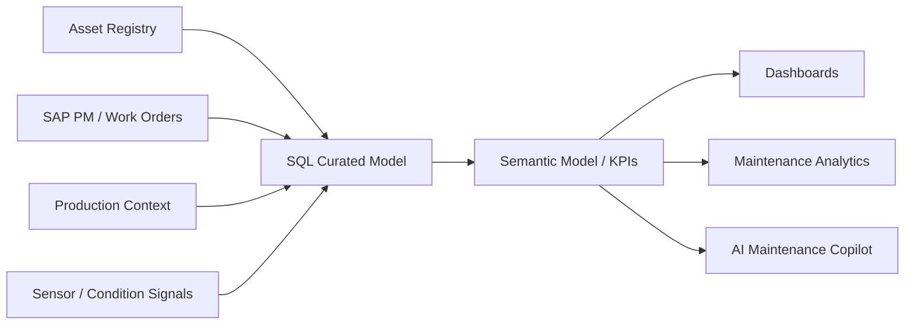

# AI-Ready Data Product Demo (GitHub-style Portfolio)

**Purpose:** An anonymised, representative portfolio demo showing how a governed industrial data product can be designed for AI consumption.

## What this demonstrates

- End-to-end **data product thinking** from source systems to consumer layer
- **SQL-based modelling** for an industrial/energy use case
- **Consumer-facing data contract** and semantic definitions
- **Governance metadata** in a Purview-style structure
- **AI agent readiness** through lineage, access control, and usage constraints

## Representative use case

**Data product:** `asset_workorder_360`

This data product combines:
- Asset registry data
- SAP PM / work order data
- Production context
- Operational risk / maintenance backlog indicators

The goal is to make trusted data available for:
- maintenance prioritisation
- operational reporting
- AI-assisted work-order triage
- management visibility on asset health and execution risk

## Repository structure

```text
/sql
  asset_workorder_360.sql
/contracts
  data_contract.yaml
/metadata
  purview_metadata.json
/docs
  architecture.md
  ai_agent_use_case.md
  business_glossary.md
  personal_contribution.md
/sample_data
  asset_workorder_360_sample.csv
```

## Architecture summary



## Governance principles

- **Classification:** Operationally critical / internal sensitive
- **Access control:** Role-based access via Entra ID groups
- **Lineage:** Source -> curated layer -> semantic model -> AI consumers
- **Usage terms:** Decision support only; no autonomous execution without human validation
- **Quality controls:** Refresh monitoring, duplicate detection, backlog reconciliation, status consistency checks

## Important note

This demo uses **synthetic and anonymised content** for portfolio purposes only. It is designed to show personal contribution and technical thinking without exposing confidential employer data.
